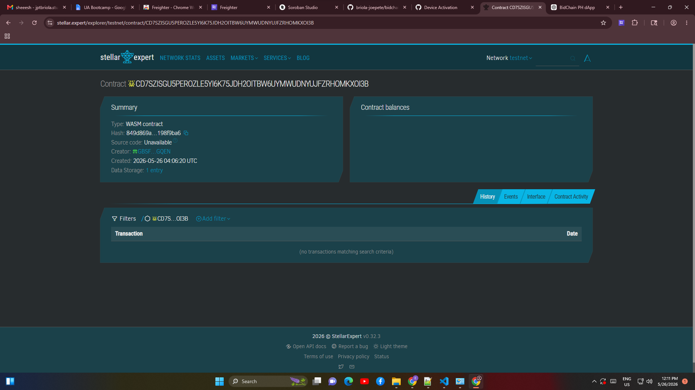

# BidChain PH  
A Soroban-powered transparent procurement system for tamper-proof municipal bid submissions.

---

## Problem  
Municipal procurement officers in small towns in the Philippines manually process contractor bids through paper documents and email attachments, causing delayed approvals, missing records, and opportunities for bid tampering that can cost local governments millions of pesos in disputed projects.

## Solution  
Contractors submit encrypted bid hashes through a Stellar Soroban dApp where submission time, contractor identity, and bid integrity are recorded immutably on-chain for instant verification by procurement officers.

---

## Timeline  
- Day 1: Smart contract development (bid submission + storage)  
- Day 2: Verification + dashboard API integration  
- Day 3: Frontend demo (procurement portal)  
- Day 4: Testing + deployment to testnet  

---

## Stellar Features Used  
- Soroban Smart Contracts  

---

## Vision & Purpose  
To eliminate bid tampering and improve transparency in local government procurement by providing a low-cost, immutable audit trail for every submitted contractor bid.

---

## Prerequisites  
- Rust (latest stable)  
- Soroban CLI (latest)  
- Stellar testnet account  

---

## How to Build  
```bash
soroban contract build
